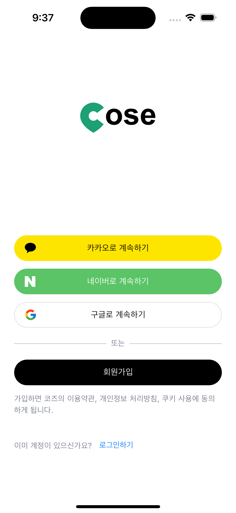

# Cose (캡스톤 디자인, 혁신적인 여행 코스 생성 앱)

## 프로젝트 개요

**Cose**는 여행과 산책을 즐기는 사용자들을 위한 혁신적인 모바일 앱입니다. `Course`와 `Pause`의 합성어로, 새로운 경로를 탐험하면서 여유롭게 다음 목적지를 선택할 수 있는 독특한 경험을 제공합니다. 사용자 중심의 직관적인 인터페이스와 실시간 장소 정보 제공으로, 여행 계획부터 실행까지 모든 과정을 즐겁고 효율적으로 만듭니다.

### 개발 기간
2024년 02월 28일 ~ 진행중

### 팀 구성
- Backend: [조민성](https://github.com/minseong204)
- Frontend: [이수하](https://github.com/zxcv74720)

## 주요 기능

1. **혁신적인 지도 탐색**
   - 원터치로 모든 장소의 상세 정보 즉시 확인
   - Naver Map API와 Search API의 창의적 조합으로 실시간 정보 제공

2. **맞춤형 코스 생성**
   - 드래그 앤 드롭으로 쉽게 장소 순서 조정
   - 실시간 코스 미리보기 및 공유 기능

3. **소셜 기능**
   - 카카오, 네이버, 구글 소셜 로그인 지원
   - 친구들과 코스 공유 및 협업 기능

4. **개인화된 프로필**
   - 사용자 정보 및 선호도 관리
   - 생성한 코스 및 방문 이력 관리

5. **실시간 알림 시스템**
   - 친구의 초대 및 코스 업데이트 알림
   - 주변 추천 장소 알림

## 기술 스택

- **프론트엔드**: Flutter 3.22.3
- **상태 관리**: Riverpod 2.5.1
- **지도 서비스**: Naver Maps API
- **소셜 로그인**: Kakao, Google, Naver SDK
- **네트워크 통신**: Dio 5.4.3
- **로컬 데이터 저장**: SQLite, Flutter Secure Storage

## 아키텍처

Cose는 Clean Architecture 원칙을 따르며, 다음과 같은 계층 구조를 가집니다:

- **Presentation Layer**: Flutter 위젯과 화면
- **Business Logic Layer**: Riverpod를 사용한 상태 관리
- **Data Layer**: 네트워크 요청 및 로컬 데이터 관리

## 핵심 기술 구현

### 1. 혁신적인 장소 탐색 시스템

Cose의 핵심 기능인 원터치 장소 정보 제공 시스템은 다음과 같이 구현되었습니다:

1. Naver Map API를 통해 사용자가 선택한 지점의 좌표를 얻음
2. 좌표를 주소로 변환 (Reverse Geocoding)
3. 변환된 주소를 기반으로 Search API를 사용하여 해당 위치의 상세 정보 검색
4. 검색 결과를 실시간으로 사용자에게 제공

이 접근 방식은 API 호출 최적화와 성능 튜닝이 필요했지만, 사용자에게 무한한 탐색 가능성과 최신 정보를 제공하는 큰 장점이 있습니다.

### 2. 효율적인 상태 관리

Riverpod를 사용하여 앱의 상태를 효과적으로 관리합니다. 주요 provider들:

- `authProvider`: 인증 관련 상태 관리
- `courseProvider`: 코스 정보 관리
- `mapProvider`: 지도 관련 상태 관리
- `profileProvider`: 사용자 프로필 정보 관리

이를 통해 상태 의존성을 명확히 하고, 테스트 용이성을 높였습니다.

### 3. 보안 강화된 네트워크 통신

Dio 라이브러리를 기반으로 한 `TokenDioClient` 클래스를 구현하여:

- 자동 토큰 갱신
- 요청/응답 인터셉터를 통한 에러 핸들링
- SSL Pinning을 통한 보안 강화

등의 기능을 제공합니다.

## 성능 최적화

1. **효율적인 상태 관리**: Riverpod를 사용하여 앱의 상태를 효율적으로 관리하고, 불필요한 리빌드를 방지합니다.
2. **지연 로딩**: 필요한 시점에 데이터를 로드하여 초기 로딩 시간을 단축합니다. (`CourseDetailScreen`, `MapScreen`의 FutureBuilder)
3. **로컬 데이터 저장**: SQLite를 사용하여 자주 사용되는 데이터를 로컬에 저장하고, 빠르게 접근합니다.

## 스크린샷 및 데모

### 지도 화면 및 코스 생성
|  |  |
|:---:|:---:|
| 지도 탐색 | 코스 생성 |

### 코스 상세 정보
|  |  |  |
|:---:|:---:|:---:|
| 코스 개요 | 장소별 메모 | 코스 미리보기 |

### 프로필 관리
|  |  |
|:---:|:---:|
| 프로필 화면 | 프로필 이미지 변경 |

### 인증 화면
|  |  |  |
|:---:|:---:|:---:|
| 로그인 선택 | 이메일 로그인 | 회원가입 |

### 비밀번호 재설정
|  |  |  |
|:---:|:---:|:---:|
| 이메일 입력 | 인증 코드 입력 | 새 비밀번호 설정 |

## 배운 점 및 향후 계획

### 기술적 도전과 극복

1. **상태 관리 프레임워크 전환 (GetX에서 Riverpod로)**:
   - 초기에는 GetX를 사용하여 상태 관리를 구현했으나, 프로젝트가 복잡해짐에 따라 Riverpod로 전환했습니다.
   - 이 과정에서 각 프레임워크의 장단점을 깊이 이해하게 되었습니다:
     - GetX:  빠른 개발이 가능하고 간단한 상태 관리를 지원하지만, 타입 안정성과 의존성 주입의 명확성에서 한계가 있었습니다. 또한, 규모가 커질수록 코드의 복잡성이 증가했습니다.
     - Riverpod: 타입 안정성이 뛰어나고, 테스트 용이성 및 의존성 주입의 명확성 면에서 강력한 장점을 가지고 있습니다. 이를 통해 코드의 구조가 명확해지고, 유지보수성이 향상되었습니다.
   - Riverpod로의 전환을 통해 코드의 가독성과 유지보수성이 크게 향상되었습니다.
   - 이 경험을 통해 프로젝트의 규모와 복잡성에 따라 적절한 도구를 선택하는 것의 중요성을 배웠습니다.

2. **실시간 데이터 처리 최적화**:
   - Naver Map API와 Search API를 연동하는 과정에서 성능 이슈에 직면했습니다.
   - 이를 해결하기 위해 다음과 같은 전략을 구현했습니다:
     - 비동기 처리 최적화: Future와 Stream을 효과적으로 활용
   - 이 과정에서 데이터를 효율적으로 처리하는 방법과 사용자 경험을 해치지 않으면서 성능을 최적화하는 기술을 습득했습니다.

3. **플랫폼 간 일관성 유지**:
   - iOS와 Android 간의 UI 및 기능 차이를 최소화하기 위해 노력했습니다.
   - 플랫폼별 코드 분기를 최소화하고, Flutter의 크로스 플랫폼 특성을 최대한 활용했습니다.
   - 이 과정에서 다양한 기기와 OS 버전에 대응하는 유연한 설계의 중요성을 깨달았습니다.

### 향후 개선 계획

1. **코드 품질 향상**:
   - 정적 분석 도구를 더 적극적으로 활용하여 코드 품질을 지속적으로 개선할 예정입니다.

2. **국제화 및 현지화**:
   - 다국어 지원을 확대하여 글로벌 시장 진출을 준비하겠습니다.
   - Flutter의 국제화 기능을 깊이 학습하고 적용할 예정입니다.

이러한 경험과 계획을 통해, 단순한 기능 구현을 넘어 확장 가능하고 유지보수가 용이한 고품질 애플리케이션을 개발하는 역량을 키워나가고 있습니다.

## 라이선스

이 프로젝트는 MIT 라이선스 하에 배포됩니다. 자세한 내용은 [LICENSE](LICENSE) 파일을 참조하세요.
